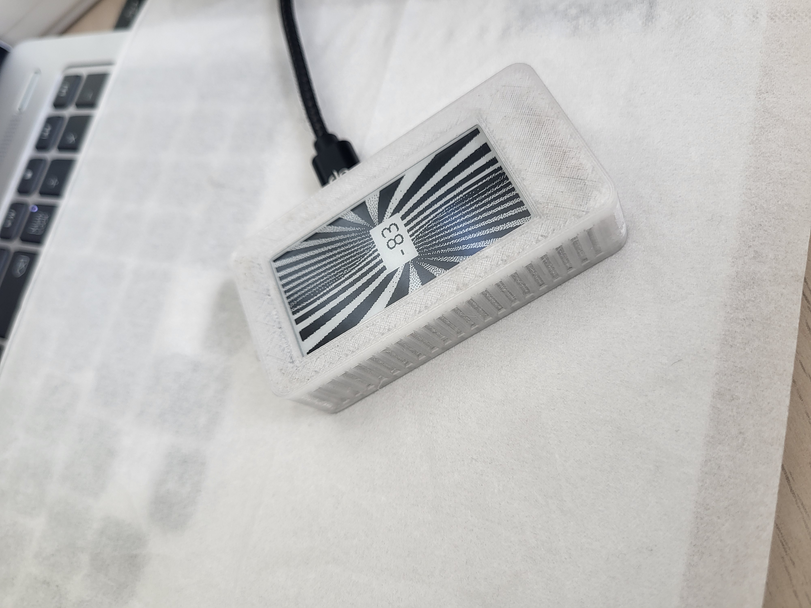
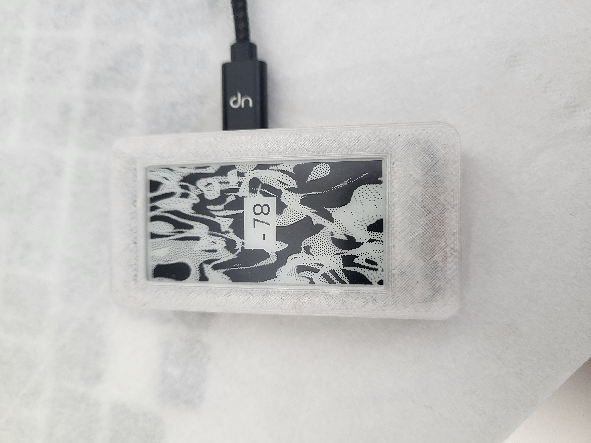

# stealth_base
A pwnagotchi sudo-plugin that stealths your pwnagotchi when near a specific ap.
I say  'sudo-plugin' as this is not your typical plugin - additional setup is needed.  

This plugin comes in two parts, the first is a normal plugin (stealth_base.py) that can be installed
just like any other plugin. This looks out for a specific ssid, and when found *stops the pwnagotchi service*.
It will then run the second part (stealth_worker.py) *as a service* and this is what will be running
while you are in range of the target ssid. Once out of range, the pwnagotchi service is restarted as normal.







## Basic Setup
First install the stealth_base.py as you would normally, ie, copy it to your pwnagotchi in your custom plugins location.
For me this is:  
``/usr/local/share/pwnagotchi/installed-plugins``

Then, copy over these files to your pwnagotchi. They can go anywhere, I have placed them in my custom plugins location:
- stealth_worker.py
- stealth_base_photos/*  

## Configuration
Next lets add some lines to our config file so we can test to see if our service has been setup correctly.
Open up your config (via `config` or `sudo nano /etc/pwnagotchi/config.toml`) and add:
```
main.plugins.stealth_base.enabled = true
main.plugins.stealth_base.ssid = "your-ap-ssid-here" # Required. The ssid to stealth around
main.plugins.stealth_base.minimum_signal_strength = -85 # Required. The lowest singnal strength allowed before we consider te ssid out of range
main.plugins.stealth_base.worker_script = "/usr/local/share/pwnagotchi/installed-plugins/stealth_worker.py" # Required. The script to run when stealthing
main.plugins.stealth_base.imageDir = '/usr/local/share/pwnagotchi/installed-plugins/stealth_base_photos' # The path to photos.
main.plugins.stealth_base.missNum = 3 # Default 3. Number of times we can go out of range of the ssid before exiting
main.plugins.stealth_base.ssid_check_interval = 5 # Default 5. In seconds, how often we check to see if our target ssid is in range
main.plugins.stealth_base.screen_refresh_interval = 30 # Default 30. # In seconds, how often we refresh the screen with a new image
```  
Lets go through some of these values. 
`stealth_base.ssid` : Change this to the ssid that you want to activate 'stealth' around.
`minimum_signal_strength` : This is the signal strength. -20 is very good connection, and -90 is out of range. If the stealth_base.ssid's strength is above this value, we will activate stealth.
`worker_script`: This can be anything, used only for printing. I will probs remove this later. 

## Create your service  
pwnagotchi is ran using systemctl. We will create our own systemctl service to run during stealth.
On your pwnagotchi, create the following file:  
``sudo touch /etc/systemd/system/stealth_worker.service``  
Now add the following to this file:  
```
[Unit]
Description=Stealth Worker Service
After=network.target

[Service]
ExecStart=/usr/bin/python /path/to/your/installed-plugins/stealth_worker.py
Restart=no
User=root
WorkingDirectory=/path/to/your/installed-plugins/
Environment=PYTHONUNBUFFERED=1
StandardOutput=syslog
StandardError=syslog

[Install]
WantedBy=multi-user.target
```   
Make sure to change '/path/to/your/installed-plugins/' to its correct path. For me this was ``/usr/local/share/pwnagotchi/installed-plugins``  

## Testing your service
After you have created the service file, its time to test. Note - you'll need the config values set for the new service to run properly. Note, if you have named the service file something different, you'll need to replace 'stealth_worker.service'.  You'll also need to change this value in stealth_base.py
Reload the systemd daemon to pick up the new service configuration:
`sudo systemctl daemon-reload`
Start the service:
`sudo systemctl start stealth_worker.service`
Verify the service status:
`sudo systemctl status stealth_worker.service`
If theres a problem you can Monitor the service logs:
`sudo journalctl -u stealth_worker.service`
Any/or view the log file:
`cat /path/to/your/installed-plugins/stealth_worker.log`
It will also put warning and error logs in:
`cat /etc/pwnagotchi/log/pwnagotchi.log`

When you start your new service with `sudo systemctl start stealth_worker.service`, you should see that the pwnagotchi service has stopped (`sudo systemctl status pwnagotchi`). Then, *if you are near your target ssid*, a random image from  `main.plugins.stealth_base.imageDir` should be displayed, with your target ssid's strength in the middle.

Now lets stop this new service, and start the pwnagotchi service:
```
sudo systemctl stop stealth_worker
sudo systemctl start pwnagotchi
```
Any thats it! You should be good to go. Now with the plugin enabled, something like the following will be in the logs, once you are near enough to your target ap:
```
2:30:37 [INFO] [stealth_base] on_unfiltered_ap_list self.ready: 1
12:30:37 [INFO] {self.tag} FOUND stealth network nearby on channel 1 (rssi: -80)
12:30:37 [INFO] {self.tag} Strength threshold hit...
12:30:38 [INFO] [stealth_base] Starting script: /usr/local/share/pwnagotchi/installed-plugins/stealth_worker.py
... you may still get some pwnagotchi-typical logs here before we have stoped the service...
12:30:39 [INFO] [stealth_base] sudo systemctl start stealth_worker.service : Exit code 0
12:30:39 [INFO] 
12:30:44.970] [WARNING] [stealth_worker] Stopping pwnagotchi service
12:30:49.370] [WARNING] [stealth_worker] pwnagotchi service was already stopped.
12:41:55.938] [WARNING] [stealth_worker] 2 attempts remaining for your-target-ssid-here : -87/-85
... ect. logs everytime we go past the strength threshold untill:...
12:45:58.101] [WARNING] [stealth_worker] 0 attempts remaining for your-target-ssid-here : -89/-85
12:45:58.963] [WARNING] [stealth_worker] Starting pwnagotchi service
12:45:36 [INFO] webcfg: Plugin loaded.
12:45:36 [INFO] Session-stats plugin loaded.
... ect ...
```
 For more verbose info on what's going on with this plugin, a full log can be found in the same dir as stealth_worker.py called stealth_worker.log.


